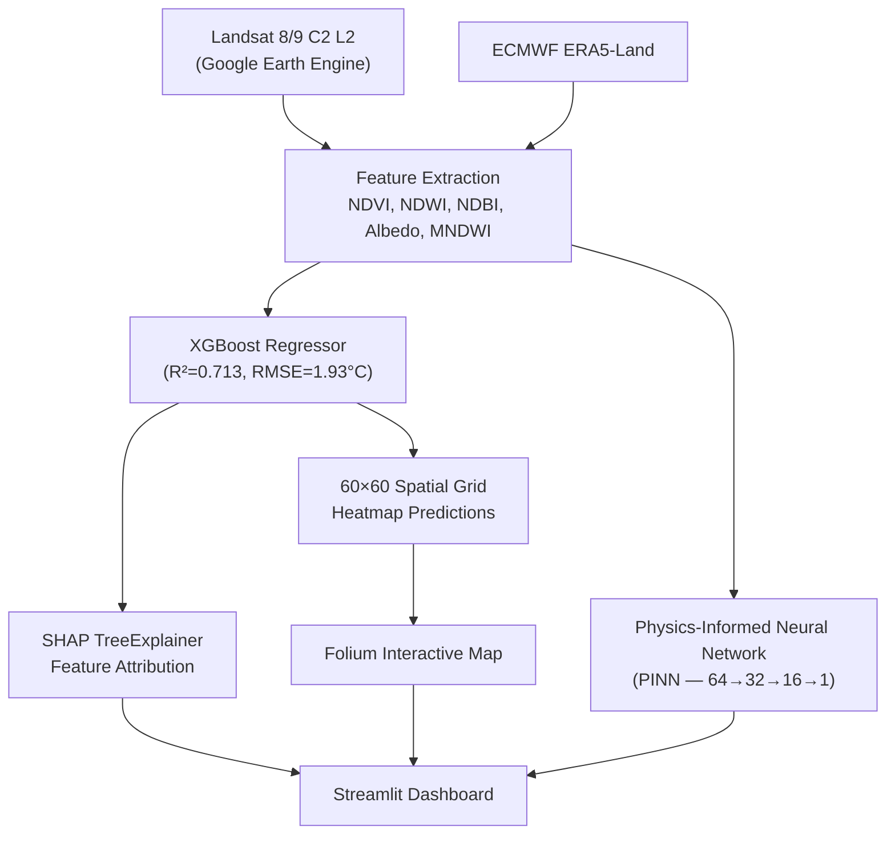

#Urban Heat Island Predictor
### ISRO × Hack2Skill 2026 — Problem Statement: Optimizing Urban Heat Mitigation via AI/ML

A geospatial AI/ML system that identifies urban heat stress hotspots, quantifies key drivers of urban heating, and generates optimized scenario-based cooling interventions — backed by physics-informed decision-making.

**Live Demo:** [https://urban-heat-island-spfvstymdsbq5zocoqb8bu.streamlit.app]

---

##Architecture Overview



| Component | Technology | Purpose |
|-----------|-----------|---------|
| **Frontend** | Streamlit + Custom HTML/CSS | Dark glassmorphism UI with Syne + Outfit fonts |
| **ML Model** | XGBoost (scikit-learn) | Primary LST prediction from 5 spectral indices |
| **Physics Model** | PyTorch PINN | Physics-constrained comparison model |
| **Explainability** | SHAP TreeExplainer | Per-feature warming/cooling attribution |
| **Maps** | Folium + Leaflet.js | Interactive geospatial heatmaps |
| **Charts** | Plotly | Historical trend visualizations |
| **Data** | Landsat 8/9 + ERA5 | Satellite imagery + reanalysis climate data |

---

##Cities Covered
| City | Climate Zone | Data Period | Population | description |
|------|-------------|-------------|------------|-------------|
| **Hyderabad** | Semi-arid | Apr–Jun 2025 | 10.5M | Fastest-growing tech hub with significant UHI effects in the HITEC City and Secunderabad corridors. |
| **Delhi** | Hot semi-arid | Apr–Jun 2025 | 32.9M | Experiences extreme UHI intensity (5–10°C above rural) during peak summer, with severe hotspots in Old Delhi, Anand Vihar, and industrial zones. |
| **Mumbai** | Tropical wet | Mar–May 2025 | 21.7M | Coastal location moderates UHI effects, but dense built-up areas in Dharavi, Kurla, and Andheri show significant heat intensification. |
| **Chennai** | Tropical wet-dry | Apr–Jun 2025 | 11.5M | Rapid coastal urbanization creates hotspots in T. Nagar, Ambattur industrial estate, and Guindy despite coastal moderation. |

---

##Dashboard Interface Controls

### 1. Planning Bar (Top Controls)
- **Location Type**: Switch between `Preset City` (4 predefined cities) or `Custom Location` (anywhere in India via coordinates).
- **Custom Coordinates**: Specify Latitude and Longitude with boundary validation.
- **PINN Comparison**: Enable/disable the PyTorch Physics-Informed Neural Network comparison panel alongside XGBoost.
- **Vulnerability Overlay**: Overlay population-weighted vulnerability markers on the map to pinpoint high-risk community zones.

### 2. Sidebar Environmental Drivers (Real-time Sliders)
Adjust parameters to simulate custom microclimate scenarios:
- **NDVI** (Normalized Difference Vegetation Index): Healthy green cover. Higher = cools via shading & evapotranspiration.
- **NDWI** (Normalized Difference Water Index): Surface water/moisture. Higher = cools via evaporation.
- **NDBI** (Normalized Difference Built-up Index): Concrete/pavement density. Higher = traps heat.
- **Albedo** (Surface Reflectivity): Solar reflection. Lower = absorbs solar radiation, increasing LST.
- **MNDWI** (Modified NDWI): Noise-free urban water index for identifying lakes and rivers.

---

##Comprehensive Feature Walkthrough

### 1. Simulation Dashboard Tab
This is the core workspace containing:
- **Real-time Prediction Cards**: Displays predicted LST, deviation from city mean, heat risk classification, and the primary driving feature.
- **Heat Stress Index (WBGT)**: LST-adjusted Wet Bulb Globe Temperature approximation to measure heat hazard.
  - 🟢 `< 28°C` — Low risk
  - 🟡 `28–32°C` — Moderate risk
  - 🟠 `32–35°C` — High risk
  - 🔴 `> 35°C` — Extreme risk (Outdoor work dangerous)
- **Interactive Geospatial Heatmap**: Folium heatmap overlay representing LST distribution on a 60x60 grid with satellite and dark map toggle controls.
- **Top 3 Priority Intervention Zones**: Automatically isolates the 3 highest temperature hotspots in the city coordinates for priority cooling projects.
- **Upcoming Mitigation Projects**: Selectable preset cards to run simulations:
  -  *Plant Urban Forest* (NDVI +0.15, NDBI -0.05)
  -  *Install Cool Roofs* (NDWI +0.05, NDBI -0.10)
  -  *Restore Water Body* (NDWI +0.12, NDBI -0.03)
- **Quantified Savings Card**: Computes daily cooling energy savings (MWh/day), avoided carbon emissions (tCO₂/yr), and financial cost savings (Lakhs/yr) across a 10 km² zone using EPA and Indian power tariff models.
- **SHAP Feature Attribution**: Interactive bar chart displaying feature contributions pushing temperatures up (saffron/warming) or down (cyan/cooling).
- **📄 Downloadable Analysis Report**: Generates and downloads a complete plain-text diagnostics report with model parameters, SHAP rankings, and action items.

### 2. City Comparison Tab
Compares Hyderabad, Delhi, Mumbai, and Chennai side-by-side:
- Mean LST & Heat Risk levels.
- Primary environmental driver (e.g., low albedo or high built-up index).
- Historical temporal trend slope.

### 3. Temporal Trends Tab
- **LST vs. NDVI Dual-Charts**: Side-by-side Plotly charts plotting LST trend alongside NDVI greening trend from 2017 to 2025.
- **Correlation Analysis**: Computes Pearson correlation coefficient ($r$) dynamically. Shows strong causal evidence ($r \approx -0.98$ in Hyderabad) demonstrating how vegetation expansion (greening) directly cools the city.

---

##Recommended Judge Demo Flow
1. **Onboarding**: Start at the **How to Use** tab to show the structural setup guide.
2. **Geospatial Hotspots**: Go to **Simulation Dashboard** and select **Hyderabad** -> Point out the ** Folium Heatmap** and the **🎯 Top 3 Priority Intervention Zones** dynamically extracted below the map.
3. **Run Interventions**: Click **"Simulate Urban Forest"** -> Watch LST metrics decrease and review the **🌱 Quantified Savings** card showing MWh energy saved and carbon offset.
4. **Inspect Causality**: Switch to **Temporal Trends** -> Point out the LST↓ vs. NDVI↑ charts showing a negative correlation ($r \approx -0.98$) from historical satellite data.
5. **Offline Handout**: Click **"Download Full Analysis Report (.txt)"** to save the diagnostics summary locally.

---

## 🚀 Local Installation & Deployment

### Requirements
Ensure you have Python 3.10+ and install dependencies:
```bash
pip install -r requirements.txt
```

### Run Locally
```bash
git clone <your-repo-url>
cd isro-uhi-predictor
streamlit run app.py
```

### Required Model Binaries & Datasets
Make sure the following files are in the root directory:
- `xgb_model.pkl` (Trained XGBoost Regressor)
- `scaler.pkl` (StandardScaler for inference)
- `model_metadata.pkl` (Feature stats, city metadata, baseline metrics)
- `X_test_sample.pkl` (Background sample for SHAP calculations)
- `pinn_model.pth` / `pinn_artifacts.pkl` (PINN network weights & scalers)
- `uhi_trend_*.csv` / `uhi_trend_*_meta.json` (Per-city historical datasets)

---

##Repository Structure
```
├── app.py                        # Streamlit dashboard application
├── xgb_model.pkl                 # Trained XGBoost model binary
├── scaler.pkl                    # StandardScaler for spectral features
├── model_metadata.pkl            # Feature stats, city encodings, metrics
├── X_test_sample.pkl             # Scaled test sample for SHAP background
├── pinn_model.pth                # Trained PINN PyTorch weights
├── pinn_artifacts.pkl            # PINN scalers and architecture info
├── uhi_trend_*.csv               # Per-city temporal trend datasets
├── uhi_trend_*_meta.json         # Per-city trend linear regression stats
├── requirements.txt              # Dependency file
└── FINALISRO.ipynb               # GEE data pipeline & model training notebook
```

---

##System Pipeline & Validation

### Layer 1 — Data Pipeline (Google Earth Engine)
- **Landsat 8/9 C02 T1 L2**: Surface Temperature (ST_B10) & spectral bands.
- **ECMWF ERA5-Land**: Air temperature at 2-meter heights.
- Cloud masking via `QA_PIXEL` bitmask, scale factors applied per USGS specification.

### Layer 2 — Feature Engineering
- **LST**: Target land surface temperature.
- **NDVI**: $(NIR - Red) / (NIR + Red)$
- **NDWI**: $(Green - NIR) / (Green + NIR)$
- **NDBI**: $(SWIR - NIR) / (SWIR + NIR)$
- **MNDWI**: $(Green - SWIR) / (Green + SWIR)$
- **Albedo**: Broadband shortwave reflectivity calculated via Liang (2001) formula.

### Layer 3 — ML Validation
- **Spatial Block Cross-Validation**: Data split is structured by per-city spatial blocks using a `GroupShuffleSplit` strategy to prevent leakage from spatially correlated neighbor pixels.
- **XGBoost Driver Model**: Trained on 20,164 spatial samples. $R^2 = 0.713$, $RMSE = 1.93^\circ\text{C}$.
- **Physics-Informed Constraints (PINN)**: Built in PyTorch with architecture (64 → 32 → 16 → 1). Optimized using Penman-Monteith evaporative cooling equations to penalize predictions violating physical energy balance.

---

## 👨‍💻 Submission Info
- **Team**: Antariksh Vision
- **Hackathon**: Bharatiya Antariksh Hackathon 2026 — ISRO × Hack2Skill
